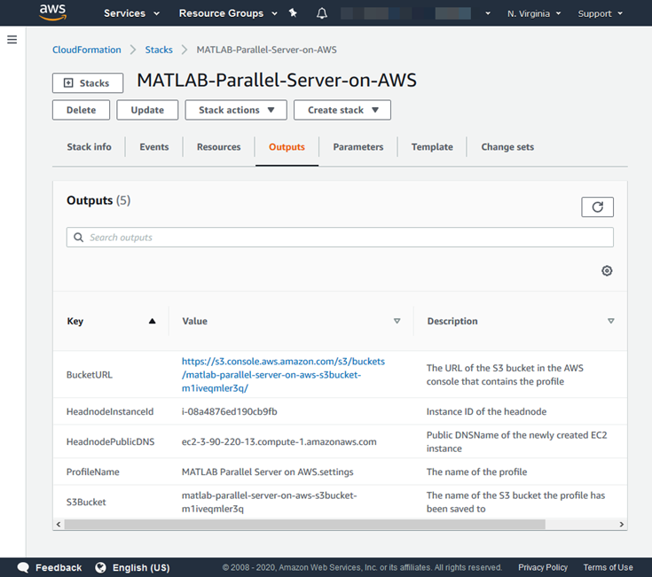
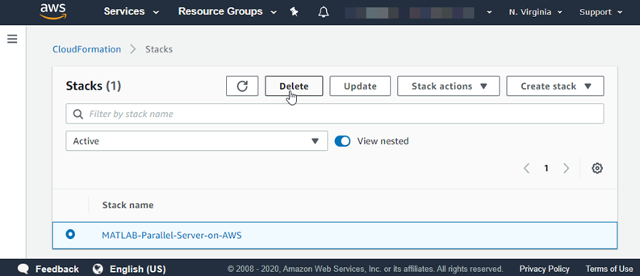

# MATLAB Parallel Server on AWS using a Network License Manager

# Requirements

Before starting, you will need the following:

* A network license manager for MATLAB hosting sufficient MATLAB Parallel Server licenses for you cluster. MathWorks provide a reference architecture to deploy a suitable [Network License Manager for MATLAB on AWS](https://github.com/mathworks-ref-arch/license-manager-for-matlab-on-aws).

## Step 1. Launch the Template

Click the **Launch Stack** button below to deploy the cloud resources on AWS. This will open the AWS console in your web browser.

> Platform: "Ubuntu 18.04 LTS"

> MATLAB Release: R2019a

> AWS Region: us-east-1

For other releases or regions, see [Templates for All Supported MATLAB Versions and AWS Regions](#templates-for-all-supported-matlab-versions-and-aws-regions)

## Step 2. Configure the Cloud Resources
After you click the Launch Stack button above, the “Create stack” page will open in your browser where you can configure the parameters. It is easier to complete the steps if you position these instructions and the AWS console window side by side.

1. Specify and check the defaults for these resource parameters:

    | Parameter label                                    | Description
    | -------------------------------------------------- | -----------
    | **Stack name** (required)                              | Choose a name for the stack. This will be shown in the AWS console.
    | **Cluster name** (required)                            | Choose a name to use for the cluster. This name will be shown in MATLAB when connected to the cluster.
    | **Number of worker instances** (required)              | Choose the number of AWS instances to start for the workers.
    | **Number of workers to start on each instance** (required) | Choose the number of MATLAB workers to start on each instance. Specify 1 worker for every 2 vCPUs, because this results in 1 worker per physical core. For example an m4.16xlarge instance has 64 vCPUs, so can support 32 MATLAB workers. See the [AWS documentation](https://aws.amazon.com/ec2/instance-types) for details on vCPUs for each instance type.
    | **Size (GB) of the database EBS volume** (optional)    | The size of the EBS volume to use for the database. All job and task information, including input and output data will be stored on this volume and should therefore have enough capacity to store the expected amount of data. If this parameter is set to 0 no volume will be created and the root volume of the instance will be used for the database.
    | **Instance type for the head node** (required)         | Choose the AWS instance type to use for the head node, which will run the job manager. No workers will be started on this node, so this can be a smaller instance type than the worker nodes. All [AWS instance types](https://aws.amazon.com/ec2/instance-types) are supported.
    | **Instance type for the worker nodes** (required)      | Choose the AWS instance type to use for the workers. All [AWS instance types](https://aws.amazon.com/ec2/instance-types) are supported.
    | **Name of SSH key** (required)                         | Choose the name of an existing EC2 KeyPair to allow SSH access to all the instances. If you do not have one, [follow the AWS instructions to create one.](https://docs.aws.amazon.com/AWSEC2/latest/UserGuide/ec2-key-pairs.html)
    | **CIDR IP address range of client** (required)         | This is the IP address range that will be allowed to connect to this cluster. The format for this field is IP Address/Mask. 
<em>Example</em>: 
10.0.0.1/32 <ul><li>This is the public IP address which can be found by searching for "what is my ip address" on the web. The mask determines the number of IP addresses to include.</li><li>A mask of 32 is a single IP address.</li><li>Use a [CIDR calculator](https://www.ipaddressguide.com/cidr) if you need a range of more than one IP addresses.</li><li>You may need to contact your IT administrator to determine which address is appropriate.</li></ul>

    | **VPC** (required) | The ID of an existing Virtual Private Cloud to deploy this stack in
    | **Subnet** (required) | The ID of an existing subnet for the head node and worker nodes. Choose a subnet in an Availability Zone that supports the instance types you have specified.
    | **Network license manager hostname** (required)        | The hostname or IP address of the instance hosting your network license manager.
    | **Network license manager port** (required)            | The port to use when connecting to your network license manager.

2. Tick the box to accept that the template uses IAM roles. These roles allow:
  * the instances to transfer the shared secret information between the nodes, via the S3 bucket, to establish SSL encrypted communications
  * the instances to write the cluster profile to the S3 bucket for secure access to the cluster from the client MATLAB
  * a custom lambda function to delete the contents of this S3 bucket when the stack is deleted

3. Click the **Create** button.

When you click Create, the cluster is created using AWS CloudFormation templates.

## Step 3: Connect to Your Cluster From MATLAB

1. After clicking **Create** you will be taken to the Stack Detail page for your Stack. Wait for the Status to reach **CREATE\_COMPLETE**. This may take up to 10 minutes.
2. Select **Outputs**. The screen should look like the one in Figure 1.

    

    *Figure 1: Stack Outputs On Completion*

3. Click the link next to **BucketURL** under **Outputs**.
4. Select the profile (**ClusterName.settings**) and click **Download**.
5. Open MATLAB.
6. In the Parallel drop-down menu in the MATLAB toolstrip select **Create and Manage Clusters...**.
7. Click **Import**.
8. Select the downloaded profile and click open.
9. Click **Set as Default**.
10. (Optional) Validate your cluster by clicking the **Validate** button.

After setting the cloud cluster as default, the next time you run a parallel language command (such as `parfor`, `spmd`, `parfeval` or `batch`) MATLAB connects to the cluster. The first time you run a task on a worker it will take several minutes for the worker MATLAB to start. This delay is due to initial loading of data from the EBS volumes. This is a one-time operation, and subsequent tasks begin much faster.

Your cluster is now ready to use. It will remain running after you close MATLAB. Delete your cluster by following the instructions below.

**NOTE**: Use the profile and client IP address range to control access to your cloud resources. Anyone with this file can connect to your resources from a machine within the specified IP address range and run jobs on it.

# Additional Information

## Delete Your Cloud Resources

You can remove the CloudFormation stack and all associated resources when you are done with them. Note that you cannot recover resources once they are deleted. After you delete the cloud resources you cannot use the downloaded profile again.

1. Select the Stack in the CloudFormation Stacks screen.  Select **Actions/Delete**.

     

2. Confirm the delete when prompted.  CloudFormation will now delete your resources which can take a few minutes.

## Troubleshooting

If your stack fails to create, check the events section of the CloudFormation console. It will indicate which resources caused the failure and why.

If the stack created successfully but you are unable to validate the cluster check the logs on the instances to diagnose the error. The logs are output to /var/log on the instance nodes; the files of interest are cloud-init.log, cloud-init-output.log, mathworks.log and all the logs under /var/log/mdce.

## Templates for All Supported MATLAB Versions and AWS Regions

To deploy a template, select a MATLAB version (e.g., R2019a), the template type (e.g., MJS-Cluster-Template-with-license-manager) and the AWS region into which you will be deploying (e.g., eu-west-1) from the following table.

As of R2019a, this reference architecture supports the eu-west-1 AWS region in addition to us-east-1.

 | Release | Region | Template | Base Operating System | Launch |
 | ------- | ------ | -------- | --------------------- | ------ |
 | MATLAB R2019a | us-east-1 | MJS-Cluster-Template-with-license-manager | Ubuntu 18.04 LTS |  |
 | MATLAB R2019a | eu-west-1 | MJS-Cluster-Template-with-license-manager | Ubuntu 18.04 LTS |  |
 | MATLAB R2018b | us-east-1 | MJS-Cluster-Template-with-license-manager | Ubuntu 16.04 LTS |  |
 | MATLAB R2018a | us-east-1 | MJS-Cluster-Template-with-license-manager | Ubuntu 16.04 LTS |  |
